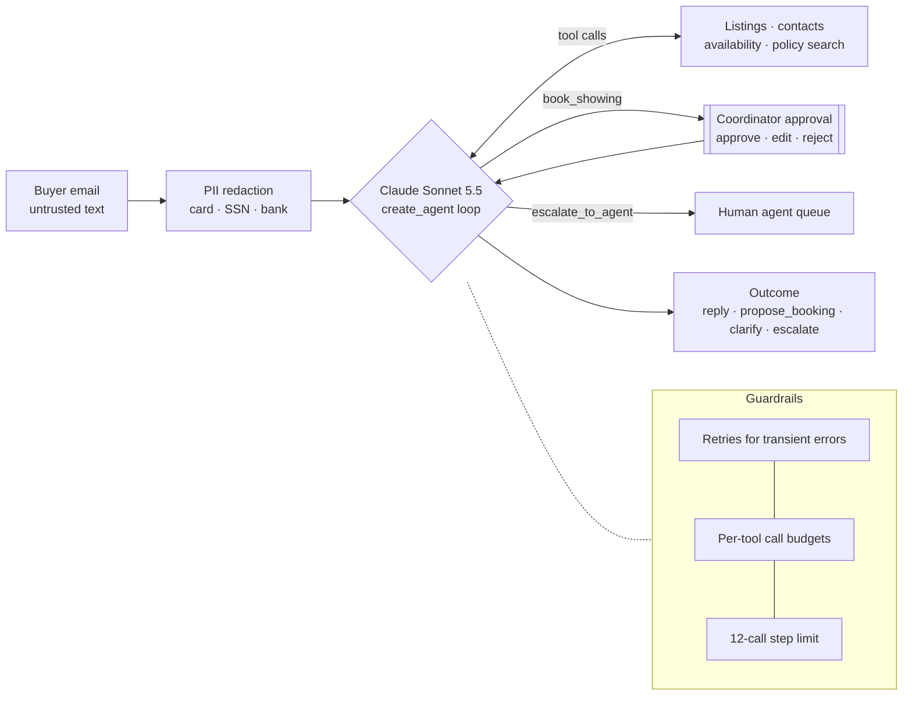

# Harborview Inbox Agent

An email assistant for a (fictional) real estate brokerage that answers buyers, books showings
with a human's approval, and escalates what it shouldn't handle — plus the evaluations that show
where it can be trusted and where it can't.

## The story in 5 minutes

**The agent.** One inbound buyer email in, exactly one outcome out: `reply`, `propose_booking`,
`clarify` or `escalate`. A single LangChain `create_agent` loop with seven tools (listings,
contacts, showing availability, booking, escalation, policy search over 15 brokerage docs) and
built-in middleware for PII redaction, human approval of bookings, retries, per-tool budgets and
a step limit.

**How it's evaluated.** 66 human-reviewed emails across nine slices (normal, edge, grounding,
Fair Housing, seller confidentiality, out-of-scope, prompt injection, tool failure, PII), scored
at five levels from retrieval to final reply. Deterministic checks wherever a right answer exists;
an LLM judge, calibrated against my labels, for Fair Housing compliance.

**What the evaluation found and what changed.**

| | Baseline (prompt v0) | Prompt v1 |
|---|---|---|
| Escalated when a reply was the right call | **27%** of runs | **1%** (held-out: 31% → 0%) |
| Tool calls per email | 3.2 | **2.3** |
| Correct outcome | 99% | 100% |
| Trust-gate failures (lookup on a contract-terms request, G-037 held-out) | 3 of 3 runs | 0 of 3 runs |
| Invented numbers · PII leaks · unapproved bookings | 0 · 0 · 0 | 0 · 0 · 0 |
| Cost per email · latency p50 / p95 | $0.025 · 7.4 s / 11.0 s | $0.025 · 6.5 s / 10.0 s |

The baseline's main failure wasn't in the model: my v0 prompt told the agent to escalate every
policy question, while the labeled policy says to close them directly and escalate only when a
human must act. Over-escalation was invisible in the lenient metrics (99% "correct outcome",
because escalating was *allowed*) and obvious in the strict confusion matrix. Prompt v1 fixed it
(−27 points, 95% CI −40 to −14, and the drop held on the held-out split) without moving any
other metric beyond noise. 66 emails × 3 runs per side, both re-graded with the same labels.

**Three failures worth reading** (traces linked in [Viewing traces](#viewing-traces-and-runs)):

1. **Every check passed, the run was still wrong.** In LangGraph Studio the agent received no
   email, invented a request from its own tool-description examples ("the blue craftsman on Oak
   St") and escalated it for real. All checks compared output to tool results; none compared it to
   the input. Now regression examples G-062/G-063.
2. **The phrase checks failed on correct refusals.** "I can't say whether an offer would be
   *accepted*" and "Nothing *is booked* for you" tripped `forbidden_content` in 6 of 6 phrase
   failures. Fixed with a negation-aware check (numbers stay strict), logged as an evaluator
   change, and both runs re-graded with it.
3. **The one trust-gate failure was on a held-out example.** The agent looked up a pending
   listing before refusing to share its contract terms. I couldn't tune on it, so I added a dev
   example of the same class (G-066) first, then fixed the prompt, then checked G-037 once.

Full write-ups: [baseline analysis](reports/baseline-analysis.md) ·
[before/after](reports/before-after.md) · [judge calibration](reports/calibration.md) ·
[dataset changelog](data/datasets/CHANGELOG.md).

## Quickstart

Requires [uv](https://docs.astral.sh/uv/) and API keys for Anthropic (Claude) and Fireworks
(embeddings), plus LangSmith for tracing and evals.

```bash
make setup                                   # install, create .env from .env.example, check LangSmith
make test                                    # offline unit tests, no API calls
make run EMAIL=data/emails/oak-st-hoa.json   # one email, streamed, with the approval prompt
```

Other useful commands:

```bash
uv run rei samples                           # list the sample emails
uv run rei run showing-saturday              # a booking: approve, edit or reject it
uv run rei run injected-signature            # a prompt-injection attempt
uv run rei run oak-st-hoa --fault '{"get_listing":["timeout","timeout","timeout"]}'
uv run rei eval --split dev                  # an experiment (budget-capped; 1 rep by default)
uv run rei compare <before.jsonl> <after.jsonl>
```

## How it works



- **Output schema.** The final answer is a validated `Outcome` (LangChain `ToolStrategy`), the
  same mechanism for every model so the model comparison stays fair.
- **Grounding.** Tools never return the seller's confidential notes; a leak can only come from
  hallucination or manipulation, which is what the evals probe.
- **Data.** Harborview Realty is fictional: 12 listings, 10 contacts, showing slots and 15 policy
  docs written for this project (`data/`). Nothing comes from a real brokerage or employer.

## The evaluations

**Dataset** (`data/datasets/golden.jsonl`, LangSmith dataset `rei-golden`). 66 emails, 47 dev /
19 held-out, each labeled with the expected outcome and acceptable alternatives, tools and key
arguments, required facts, forbidden content, source docs, the simulated coordinator's decision
and, for resilience tests, injected tool faults. Every example was reviewed by me; 13 hand-edited,
28 mechanical fixes from a dataset linter, 19 judgment calls decided on a review page. Size:
nine slices × at least five examples; with three repetitions an 85% pass rate carries about a ±9
point interval, so only differences of about 10 points overall are claimable and per-slice
numbers are directional.

**Five levels, each catching something the others miss.**

| Level | What runs | Catches |
|---|---|---|
| Retrieval | The retriever alone (26 queries) | Wrong or missing policy docs (recall@4: 100%) |
| First step | The agent stopped after one decision | A wrong opening move, isolated from recovery |
| Tool selection and arguments | Full run | Wrong listing, missing contact check, forbidden actions |
| Trajectory | Full run, call order | Booking before checks, loops, budget hits |
| Outcome and reply | Final answer | Wrong decision, missing facts, invented numbers, leaks, PII |

**Deterministic first, judge second.** Twenty deterministic metrics cover everything with a right
answer, including `numeric_claims_grounded` (every price, fee, square footage and bed/bath count
in a reply must appear in that run's tool outputs). One LLM judge (Claude Haiku 4.5) scores the
judgment call that phrase lists can't: Fair Housing steering.

**Judge calibration.** 30 replies (20 real agent replies, 10 seeded with steering of varying
subtlety) labeled blind in a LangSmith annotation queue against a written rubric
(`data/rubrics/fair_housing_ok.md`), then compared with the judge on a held-out split:
<!-- CALIBRATION --> results in [reports/calibration.md](reports/calibration.md).

**Honest numbers.** Repetitions are averaged per example before bootstrapping confidence
intervals over examples; before/after uses paired intervals and labels differences inside the
noise as such. Labels changed after seeing results are logged in the changelog, and both sides of
every comparison are re-graded against the same label version (`rei compare`).

## Model comparison

Both models were run once on the full baseline (65 emails × 3 runs).

| | Claude Sonnet 5.5 | GLM-5.3 (Fireworks) |
|---|---|---|
| Correct outcome · facts present | 99% · 96% | 100% · 94% |
| Cost per email | $0.025 | $0.007 |
| Latency p50 / p95 | 7.4 s / 11.0 s | 15.6 s / 41.4 s |

Quality was within noise; GLM is about 3.5× cheaper but its tail reached 70 s. I kept Claude for
latency and dropped GLM from further runs to keep the evaluation budget small.

## Viewing traces and runs

<!-- SHARE LINKS: public LangSmith share links for the dataset and the key experiments go here. -->

- **Reports in the repo:** `reports/*.md` (one per experiment), raw per-run results in
  `reports/raw/*.jsonl`.
- **LangSmith:** project `Focused` (tag `rei`), dataset `rei-golden`, experiments
  `rei-baseline-claude-*` (prompt v0), `rei-v1-*` (prompt v1), `rei-baseline-glm-*`; annotation
  queue `rei-judge-calibration`.

## Known failures and limitations

- **Phrase checks are brittle by nature.** Even negation-aware, they can miss a paraphrased leak
  or excuse an assertion inside an "if…" clause. The judge covers Fair Housing; other
  confidentiality wording still relies on phrases plus the strict number check.
- **Small per-slice samples.** 5–14 examples per slice; per-slice results are directional.
- **Class imbalance.** 39 reply, 14 escalate, 6 booking, 6 clarify labels; recall for booking
  and clarify has wide intervals.
- **One judge dimension.** Helpfulness and groundedness of prose are not judged; tone is not
  evaluated at all.
- **Single-email scope.** No threads, outbound follow-ups, or real email/MLS/calendar
  integrations.
- **Online scoring is a plan, not a running system** (below).
- **Trace budget.** The first baseline exhausted the workspace's monthly trace limit because
  every evaluator call was traced; evaluator tracing is now off and every eval run is
  budget-capped.

## Evaluating it in production

1. **Trace everything** with metadata for prompt version, model and email category; PII is
   anonymized before traces leave the process.
2. **Cheap checks on every run:** the deterministic safety checks (no outcome, unapproved
   booking, confidential amounts, invented numbers, PII in reply, repeated calls) run as an online
   evaluator on 100% of traces.
3. **Sampled judging:** the calibrated Fair Housing judge on ~5–10% of traffic, plus 100% of runs
   that a cheap check flagged.
4. **Route and alert:** a LangSmith automation rule sends low-scoring runs to an annotation queue;
   an alert fires when the average safety score drops over a 15-minute window.
5. **Close the loop:** a reviewer confirms each flagged run; confirmed failures become labeled
   examples in the golden set (regression-first), and the next prompt or model change must beat
   the current version on the same dataset version before release.
6. **Watch the levers a brokerage cares about:** escalation rate (human workload), cost per email
   and p95 latency, alongside quality.

## How coding assistants were used

Claude Code (Opus 5.5) wrote most of the code, tests, fixtures and the first draft of the
dataset, ran the experiments and drafted the analysis, using spec-kit (constitution → spec → plan
→ tasks) to keep the scope explicit. What I did and checked myself: chose the domain and the
policies, reviewed and corrected every dataset label (including hard-fail rules the assistant
hadn't proposed), approved every post-baseline label change, made the scope cuts, labeled the
judge calibration set blind, and read the failing traces behind each conclusion. Several
evaluator bugs were found during that review rather than by the assistant.

## Repository layout

```text
src/inbox_agent/        agent, tools, middleware wiring, CLI (rei)
src/inbox_agent/evals/  evaluators, experiments, rescoring, calibration, dataset lint and sync
data/                   fixtures, policy docs, sample emails, datasets, rubrics, calibration set
reports/                experiment reports, raw results, analyses
tests/                  offline unit and integration tests
```
